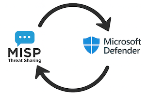

# MISP2Defender



Push threat intelligence from **MISP** to Microsoft **Defender** for Endpoint. This integration automatically syncs indicators of compromise (IoCs) from your MISP instance to Defender's threat intelligence database, enabling real-time blocking and alerting on malicious indicators.

## Features

- **Automated sync**: Pull indicators from MISP and push them to Defender on a schedule
- **Flexible filtering**: Query specific MISP events by tags, publication status, timestamps, or warning lists
- **Smart expiration**: Set different expiration times per indicator type (IPs expire faster than file hashes)
- **Duplicate detection**: Check existing Defender indicators before pushing to avoid duplicates
- **Custom user agent**: Configurable browser user agent for Microsoft API requests
- **Batch processing**: Push indicators in configurable batch sizes to respect API rate limits
- **AlienVault OTX integration**: Optionally skip indicators already known in OTX
- **Dry run mode**: Test configuration without actually pushing to Defender
- **Detailed logging**: Debug mode with parsed indicator output for troubleshooting
- **TLP support**: Shorter expiration for TLP:CLEAR indicators
- **Pagination**: Handle large MISP result sets with configurable page sizes

# Setup

## MISP

You need a working MISP instance and a MISP API key that can read from your server.

## Python virtual environment

Create a virtual environment on your MISP server (or wherever you're running the integration). For example:

```bash
cd /var/www/MISP/misp-custom/misp2defender
python3 -m venv venv
source venv/bin/activate
pip install -r requirements.txt
```

Copy `config.py.default` to `config.py` and fill in your settings.

## Microsoft Defender

### Entra application

You need an Microsoft **Entra application** (previously an Azure App registration), with an **access token** and proper **API permissions**.

1. Sign in to the [Application Registration Portal](https://portal.azure.com/#blade/Microsoft_AAD_IAM/ActiveDirectoryMenuBlade/RegisteredApps).
2. Choose **New registration**.
3. Enter an application name, and choose **Register**.
4. Note the **Application ID** (client) and **Directory ID** (tenant)
5. Under Manage, **Certificates & secrets**, choose **New client secret** and add a description. A new secret will be displayed in the **Value** column. Copy this password, it will not be shown again.
6. Assign the **API permissions**. You need at least **Ti.ReadWrite.All**.

Also see: [https://learn.microsoft.com/en-us/defender-endpoint/api/apis-intro](https://learn.microsoft.com/en-us/defender-endpoint/api/apis-intro).

### Network flows

The integration requires access to 

- `https://login.microsoftonline.com/`
- `https://api.securitycenter.microsoft.com`

# Configuration

## Microsoft Entra authentication

```python
graph_auth = {
  'tenant': '',       # Your Directory ID (tenant)
  'client_id': '',    # Application ID from the app registration
  'client_secret': '', # Client secret value (copy when creating)
}
```

The credentials for your Entra application. All three values are required.

## Microsoft API settings

```python
max_indicators_per_query = 450
quota_requests = 25
targetScope = 'https://api.securitycenter.windows.com/.default'
custom_user_agent = "Mozilla/5.0 (Macintosh; Intel Mac OS X 10_15_7) AppleWebKit/537.36"
```

- `max_indicators_per_query`: Number of indicators to push in a single request. Keep below 500 to avoid API limits.
- `quota_requests`: Maximum API calls per minute before throttling. Adjust based on your rate limits.
- `targetScope`: OAuth scope for Defender API access. Leave as default unless you know what you're doing.
- `custom_user_agent`: Custom browser user agent string for Microsoft requests. Optional, uses default if not set.

## MISP connection

```python
misp_domain = ''          # Full URL to your MISP instance
misp_key = ''             # MISP API key with read access
misp_verifycert = False   # Set to True if using valid SSL certs
```

Basic connection parameters for your MISP instance.

## MISP event filters

```python
misp_event_filters = {
    'published': True,
    'tags': ["workflow:state=\"complete\""],
    'enforceWarninglist': True,
    'publish_timestamp': '2d',
}
misp_event_limit_per_page = 100
```

Controls which MISP events get processed. You can filter by:
- `published`: Only grab published events
- `tags`: Filter by specific MISP tags (supports multiple)
- `enforceWarninglist`: Skip indicators on MISP warning lists
- `publish_timestamp`: Time window (e.g., '2d' for last 2 days, '1h' for last hour)
- Other filters: `eventid`, `date_from`, `date_to`, `last`, `limit`, etc.

The `misp_event_limit_per_page` sets pagination size when fetching events.

## Logging and debug

```python
verbose_log = True
log_file = "misp2defender.log"
log_json_file = ""
dry_run = False
write_parsed_eventid = True
write_parsed_indicators = True
```

- `verbose_log`: Enable detailed debug logging
- `log_file`: Where to write logs
- `log_json_file`: Log raw JSON responses from Defender API to this file (leave empty to disable)
- `dry_run`: Test run without actually pushing to Defender
- `write_parsed_eventid`: Log each event ID being processed
- `write_parsed_indicators`: Write parsed indicators to a JSON file for review

## MISP attribute processing

```python
misp_flatten_attributes = True
```

When enabled, extracts attributes from MISP objects and processes them as individual indicators.

## AlienVault OTX integration

```python
exclude_if_in_alienvault = False
otx_alienvault_api = ""
```

Skip indicators that already exist in AlienVault OTX. Requires an OTX API key. Slows down processing but reduces duplicate intel.

## Indicator expiration

```python
days_to_expire_ignore_misp_last_seen = True
days_to_expire = 50
days_to_expire_start = "valid_from"  # "valid_from" | "current_date"
days_to_expire_mapping = {
    "IpAddress": 90,
    "FileMd5": 99999,
    "FileSha1": 99999,
    "FileSha256": 99999,
    "Url": 365,
    "DomainName": 300,
}
days_to_expire_tlpclear = 7
```

Controls when indicators expire in Defender:
- `days_to_expire`: Default expiration in days
- `days_to_expire_start`: Calculate expiration from indicator creation (`valid_from`) or upload time (`current_date`)
- `days_to_expire_mapping`: Override expiration per indicator type. File hashes typically stay valid longer than IPs.
- `days_to_expire_tlpclear`: Short expiration for TLP:CLEAR indicators
- `days_to_expire_ignore_misp_last_seen`: Ignore MISP's last_seen timestamp when calculating expiration

## Defender indicator settings

```python
defender_application = "MISP"
defender_severity = "Medium"              # Informational, Low, Medium, High
defender_recommended_actions = "Block"
defender_generate_alert = True
defender_action = "Audit"                 # Warn, Block, Audit, Alert, AlertAndBlock, BlockAndRemediate, Allowed
```

Default values applied to all pushed indicators:
- `defender_application`: Source tag in Defender
- `defender_severity`: Alert severity level
- `defender_recommended_actions`: What analysts should do
- `defender_generate_alert`: Trigger alerts on matches
- `defender_action`: Enforcement action when indicator is detected

## Performance optimization

```python
check_if_already_in_defender = True
```

Fetch existing Defender indicators before pushing. Skips duplicates but adds initial overhead. Turn off if you're pushing to an empty Defender instance.

## Vetted attribute filtering

```python
limit_vetted_attributes_from_specific_events = ["curation:source=\"MISP-TEST\""]
vetted_attribute_classifier = ["course-of-action:active=\"deny\""]
```

Control which attributes are uploaded from specific events:
- `limit_vetted_attributes_from_specific_events`: List of event tags that trigger vetted-only mode. When an event has any of these tags, only attributes with vetted tags will be uploaded.
- `vetted_attribute_classifier`: List of attribute tags that mark an indicator as "vetted". Attributes must have at least one of these tags to be uploaded from events marked for vetting.

**Example workflow**: If you have events tagged with `curation:source="MISP-TEST"`, only attributes tagged with `course-of-action:active="deny"` will be uploaded to Defender. This ensures only reviewed/approved indicators from specific sources reach production.

# Running the Integration

## Manual test run

First, test the integration manually to verify your configuration:

```bash
cd /var/www/MISP/misp-custom/misp2defender
source venv/bin/activate
python misp2defender.py
```

Check the log file for errors and verify indicators appear in Defender.

## Automated scheduling

Set up a cron job to run the sync automatically. Edit the crontab for the web user (typically `www-data`):

```bash
sudo crontab -u www-data -e
```

Add a job that runs every 6 hours:

```cron
0 */6 * * * cd /var/www/MISP/misp-custom/misp2defender && venv/bin/python misp2defender.py >> /var/log/misp2defender-cron.log 2>&1
```

Or run it daily at 2 AM:

```cron
0 2 * * * cd /var/www/MISP/misp-custom/misp2defender && venv/bin/python misp2defender.py >> /var/log/misp2defender-cron.log 2>&1
```

The frequency depends on how often your MISP events update and how quickly you need indicators in Defender.